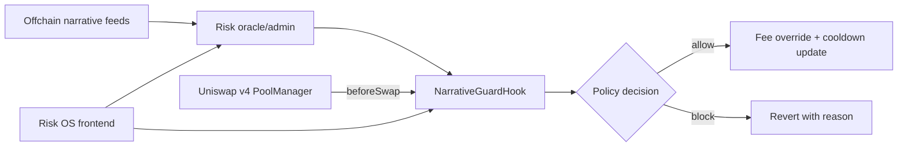

# NarrativeGuard: X Layer Meme Launch Risk OS

[](https://github.com/NarrativeGuard/narrativeguard-hook/actions/workflows/ci.yml)
[](LICENSE)
[](docs/XLAYER_MAINNET_DEPLOYMENT.md)
[](contracts/NarrativeGuardHook.sol)

NarrativeGuard is a Hook-powered risk operating system for meme launches on X Layer. At its core is a Uniswap v4 `beforeSwap` Hook that turns offchain narrative and risk signals into onchain swap policy: dynamic LP fee overrides, anti-snipe blocking, single-trade caps, cooldowns, whitelist/blacklist handling, and emergency pause.

Built for **OKX Web3 / X Layer Build X Hackathon: Hook the Future**.

## Links

| Resource | URL |
| --- | --- |
| Live Risk OS | https://narrativeguard-hook.vercel.app |
| Repository | https://github.com/NarrativeGuard/narrativeguard-hook |
| X Layer deployment notes | [docs/XLAYER_MAINNET_DEPLOYMENT.md](docs/XLAYER_MAINNET_DEPLOYMENT.md) |
| Judging brief | [docs/JUDGING_BRIEF.md](docs/JUDGING_BRIEF.md) |

## What Is Built

- **NarrativeGuardHook**: production-shaped Uniswap v4 Hook using Uniswap v4 BaseHook.
- **beforeSwap** policy engine with:
  - risk-score-based dynamic LP fee override for dynamic-fee pools;
  - launch-window anti-snipe protection;
  - max single-trade size;
  - per-pool trader cooldown;
  - global and per-pool whitelist/blacklist;
  - oracle/owner emergency pause.
- Risk OS frontend console with:
  - launch protection templates;
  - narrative risk report and top-driver view;
  - Oracle Agent Mesh panel;
  - Hook response event timeline;
  - swap gate and rule controls;
  - live X Layer deployment, policy, transaction, and event views.
- Hardhat tests for the main policy branches.
- CREATE2 deployment script for real v4 hook address flags.
- Internal audit notes and hardening checklist.
- Hackathon submission notes, X/Twitter copy, and demo video script.
- Submission checklist aligned with the official event requirements.

## Architecture



Uniswap v4 hooks are attached per pool, and hook permissions are encoded in the deployed hook address. This hook uses the BEFORE_SWAP permission flag. See the official Uniswap hook docs: https://developers.uniswap.org/contracts/v4/concepts/hooks

## Quick Start

Open the live Risk OS console:

```text
https://narrativeguard-hook.vercel.app
```

For local development:

```bash
npm install
npm run compile
npm test
npm run frontend:dev
```

The frontend is the primary deliverable path. It presents NarrativeGuard as a product console for launch teams, market makers, and pool operators. It includes a wallet-connected X Layer panel for:

- connecting through a dedicated OKX Wallet provider path, with a generic injected-wallet fallback;
- switching the interface between Chinese and English;
- switching/adding X Layer mainnet;
- loading the current deployed Hook and Pool;
- reading live onchain policy and Hook event history;
- displaying real X Layer code status and deployment transactions;
- updating narrative risk score through a wallet signature;
- pausing/resuming the guarded pool through a wallet signature;
- deploying a fresh Hook and initializing a demo v4 pool if needed.

Advanced deployment and local signing workflows are documented in [docs/LOCAL_AUTO_DEPLOY.md](docs/LOCAL_AUTO_DEPLOY.md). Do not commit environment files, private keys, or seed phrases.

## Contracts

- [contracts/NarrativeGuardHook.sol](contracts/NarrativeGuardHook.sol): core hook.
- [contracts/DemoMemeToken.sol](contracts/DemoMemeToken.sol): demo ERC20 token.
- [contracts/test/MockPoolManager.sol](contracts/test/MockPoolManager.sol): test/demo PoolManager caller.
- [contracts/test/NarrativeGuardHookHarness.sol](contracts/test/NarrativeGuardHookHarness.sol): local-only harness that skips v4 address-bit validation.

## X Layer Mainnet Deployment

X Layer mainnet chain ID is `196`, RPC is `https://rpc.xlayer.tech`, and the explorer is `https://www.okx.com/web3/explorer/xlayer`. Source: https://web3.okx.com/xlayer/docs/developer/build-on-xlayer/network-information

Current live demo addresses are recorded in [docs/XLAYER_MAINNET_DEPLOYMENT.md](docs/XLAYER_MAINNET_DEPLOYMENT.md). These addresses point to the configured X Layer Hook and initialized v4 PoolId used by the public console.

If the source is redeployed for final bytecode/source alignment, update the frontend and docs only after the new Hook has also been configured and a v4 pool has been initialized.

Hook:

```text
0xAa242C1c9Dac355D6a66eA165E3Dfa96D0924080
```

V4 PoolId:

```text
0xa9e01de25bcd4f5917afcfbb2b5728a1dfd392d360e7c9d7cefe10d4465dc893
```

PoolManager:

```text
0x360E68faCcca8cA495c1B759Fd9EEe466db9FB32
```

Recommended product/demo path:

1. Open https://narrativeguard-hook.vercel.app.
2. Use **Connect OKX** for OKX Wallet, or **Connect Wallet** as an injected-wallet fallback.
3. Use **Load Current** to load the existing X Layer deployment before demonstrating live controls.

Local development is available with:

```bash
npm run frontend:dev
```

The deployment script mines a CREATE2 salt so the real NarrativeGuardHook address has the BEFORE_SWAP flag. If the canonical CREATE2 deployer is not available on a network, the script will stop and say so.

## Official v4 Address Note

As of 2026-05-26, the Uniswap deployments page lists v4 contracts for **X Layer mainnet chain ID 196**, including PoolManager `0x360e68faccca8ca495c1b759fd9eee466db9fb32`. Source: https://developers.uniswap.org/docs/protocols/v4/deployments

## First-Prize Positioning

NarrativeGuard is positioned as **X Layer Meme Launch Risk OS**, not only a single Hook contract. The Hook is the enforcement layer; the frontend is the operator layer; the submission package explains why this can become real X Layer activity.

- Innovation: narrative risk becomes swap-path policy at `beforeSwap`, so social and wallet context can shape execution without replacing the AMM.
- Market value: meme launches need configurable defenses for LPs, teams, market makers, and traders during the highest-risk window.
- Completeness: contracts, tests, deployment scripts, live wallet console, X Layer mainnet deployment, submission copy, video script, and audit notes are included.
- Verifiability: Hook code, PoolManager, PoolId, configure transaction, initialize transaction, and read-only RPC verification are documented.

See [docs/JUDGING_BRIEF.md](docs/JUDGING_BRIEF.md) for the scoring narrative.

## Policy Model

Risk score is stored as basis points: `0` to `10_000`.

Dynamic fee:

```text
fee = baseFee + (maxFee - baseFee) * riskScore / 10_000
```

Block order:

1. Emergency pause.
2. Blacklist.
3. Whitelist bypass.
4. Anti-snipe window.
5. Single-trade cap.
6. Cooldown.
7. Allowed with optional fee override.

## Security Notes

This repository has internal hardening notes in [docs/AUDIT_NOTES.md](docs/AUDIT_NOTES.md). Independent third-party review is recommended before production TVL.

- The risk oracle can update scores and pause pools.
- Owner can configure pools and lists.
- Trusted routers may pass the real trader as the first ABI-encoded `address` in `hookData`; optional trailing router metadata is ignored. Untrusted senders are treated as the trader.
- Blacklist takes precedence over whitelist. Whitelist bypasses anti-snipe, max-trade, and cooldown checks, but not emergency pause.
- Dynamic LP fee override only applies when the pool fee is `LPFeeLibrary.DYNAMIC_FEE_FLAG`.
- Unconfigured pools fail open to avoid accidental pool bricking.

## Useful Commands

```bash
npm run compile
npm run typecheck
npm test
npm run verify:xlayer-mainnet
npm run frontend:build
npm run check
```

## Submission Checklist

See [docs/SUBMISSION_CHECKLIST.md](docs/SUBMISSION_CHECKLIST.md).

## License

MIT. See [LICENSE](LICENSE).

## References

- X Layer network information: https://web3.okx.com/xlayer/docs/developer/build-on-xlayer/network-information
- Uniswap v4 hooks: https://developers.uniswap.org/contracts/v4/concepts/hooks
- Uniswap v4 deployments: https://developers.uniswap.org/docs/protocols/v4/deployments
- Uniswap v4 PoolManager: https://developers.uniswap.org/contracts/v4/reference/core/interfaces/IPoolManager
